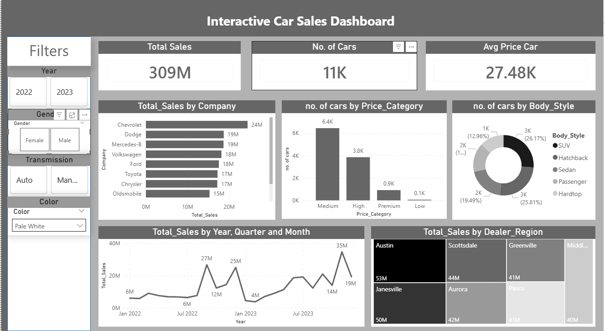

# 🚗 Car Sales Analysis Project (Python & Power BI)

## 📌 Project Overview
This project provides a comprehensive analysis of car sales data, combining data cleaning and statistical analysis using **Python** with an interactive dashboard built in **Power BI**. The goal is to identify sales trends, customer behavior, and inventory optimization opportunities.

---

## 🖼️ Dashboard Preview

*(Make sure the image file 'carDashboard.png' is in the same folder on GitHub)*

---

## 🛠️ Data Preprocessing & EDA (Python)
I started by exploring the dataset, which consists of **23,906 rows** and **19 columns**. The analysis included:
* **Data Inspection:** Used `.info()` to identify null values and data types.
* **Cleaning:** Checked for and removed duplicate records to ensure data integrity.
* **Outlier Detection:** Used `.describe()` and **Histograms** to detect anomalies.
* **Statistical Insights:**
    * **Distribution:** The price data is **right-skewed**, indicating a concentration in the lower/mid-price range.
    * **Price Ceiling:** Identified an **upper bound of $58K**. While the maximum price is $85K, **99% of customers** buy cars within the **$1,200 - $58,000** range.
    * **Correlation:** The **Scatter Plot** revealed **no significant correlation** between Annual Income and Car Price, suggesting that income is not the only driver for purchase decisions.

---

## 📊 Business Insights (Power BI Dashboard)

### 1. Sales Performance & Growth
* **Yearly Growth:** Sales increased this year by **2,000 cars**, generating approximately **$71 Million** in revenue.
* **Market Stability:** Sales are well-distributed among the top 10 selling cars, reducing the risk of dependency on a single model.
* **Regional Distribution:** The **Tree Map** shows that sales are evenly spread across all dealer regions, indicating a strong market presence.

### 2. Inventory & Seasonality
* **The "Sweet Spot":** Most sales occur in the **mid-range category ($10,000 - $25,000)** with an average of **$18,000**.
    * *Action:* Ensure high stock levels for this price segment.
* **Peak Season:** Sales consistently spike in the **last 3 months of the year**.
    * *Action:* Increase inventory levels before the end of each year to meet demand.
* **Observation:** Noted a significant drop in sales at the beginning of 2023 that requires further investigation.

### 3. Customer & Product Preferences
* **Demographics:** Male customers purchased **3 times more** cars than female customers.
* **Color Trend:** The most popular car color is **Pale White**.

---

## 🚀 Tools Used
* **Python:** Pandas, NumPy, Matplotlib, Seaborn.
* **Power BI:** Data Modeling, DAX, Interactive Visualization.
* **Excel/CSV:** Data Source.
